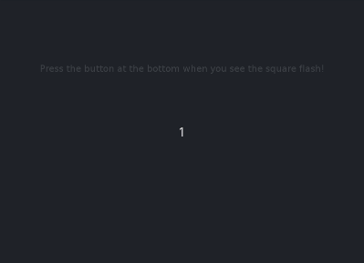

# A Simple Reaction Time Task

This reaction time task uses the same script as the [N-Back-task](../nback/) but builds on a different configuration;
essentially, it is a 0-Back task where only one stimulus colour is used.
While these items can be modified, it is advised not to do so.


## Configuration

All configuration options are essentially like those for the N-Back task. Main differences or modifications are listed here.

```
[DESIGN]
## enable the reaction time mode
## note that nback and nback_mode are obselete through this
## setting, and repeat_probability is defaulted to 1
reaction_time_only = yes

. . .

## probability of having one characteristic repeated
## default to one, but it is advised to change this to 0
## if the layout covers more than one box (see below)
# repeat_probability = 1

. . .

## number of boxes in the grid; they will be arranged in a
## square, so a square number is advantageous;
## for the reaction time task, one is advised, so that the
## stimulus is always centred
num_boxes = 1

## colour of the stimuli
## for the reaction time task only one colour should be chosen
colours = (255, 255, 0)
```

In the `[APPEARANCE]` section, the following settings are suggested for a nice reaction time task.

```ini
[APPEARANCE]
## size of the grid relative to smallest screen dimension
## the button_height will be reduced on either side of the
## screen so it is centred
canvas_size = 0.2

## the colour of grid and fixation cross
## for the reaction time task it is advised to remove the grid
## and only display the fixation cross
colour_grid = none
colour_fixation_cross = (255, 255, 255)
```

### Logging the Experiment

What should be logged is described in the `[LOG]` section of the configuration file.
For a general overview on their configuration, see [here](../../howto/logs/).
Although all fields available for the N-Back task are avaialable here, the sensitive values are as follows:

* settings for the block: `trials`
* computed data per trial: `wait` (time before stimulus is shown)
* the user response: `rt` (reaction time), `pressed` (whether a button was pressed)

## Modifications

### Moving Stimulus

To move the stimulus around, it suffices to change the following options.

```ini
[DESIGN]
## set the probability to zero so it always jumps
repeat_probability = 0
## increase the number of boxes; this experiment works best with
## square numbers
num_boxes = 49

[APPEARANCE]
## increase the canvas size so that the stimulus can use the
## whole screen
canvas_size = 0.9
```

## Example

A screencast of the Reaction Time Task.
Simple, as it is supposed to be.


